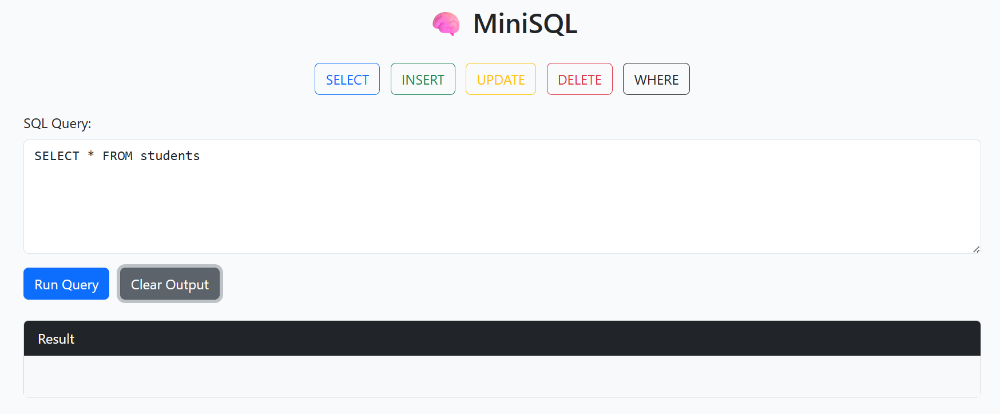
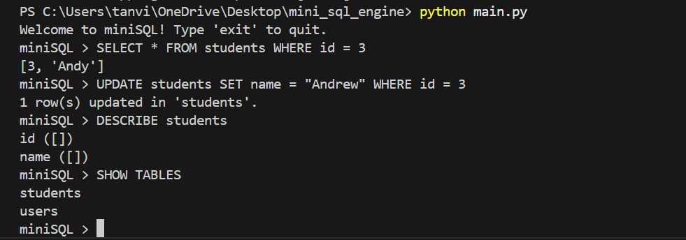

 ````markdown
# MiniSQL – A Lightweight SQL Engine in Python

MiniSQL is a custom-built SQL query engine and interpreter developed from scratch using Python. It supports parsing, executing, and persisting SQL operations, powered by a custom grammar (via Lark), an interactive CLI, and a FastAPI web interface with a visual query builder.

---

## Features

- Custom SQL parser using Lark (AST generation)  
- Support for core SQL statements:
  - `CREATE TABLE`
  - `INSERT INTO ... VALUES (...)`
  - `SELECT` with optional `WHERE`
  - `UPDATE ... SET ... WHERE`
  - `DELETE FROM ... WHERE`

- In-memory table representation with schema enforcement  
- JSON-based persistence (tables are saved and loaded automatically)  
- Web interface with:
  - Drag-and-drop SQL building blocks
  - Live results rendered as HTML tables
  - REST API endpoint for query execution

---

## Sample Queries

```sql
CREATE TABLE students (id INT, name TEXT);
INSERT INTO students VALUES (1, "Alice");
INSERT INTO students VALUES (2, "Bob");

SELECT * FROM students;
SELECT name FROM students WHERE id = 1;

UPDATE students SET name = "Charlie" WHERE id = 2;
DELETE FROM students WHERE name = "Charlie";
````

---

## How to Run

### CLI Mode

```bash
python main.py
```

### Web Interface

```bash
uvicorn web_app:app --reload
```

Then open: [http://localhost:8000](http://localhost:8000)
Optional Swagger UI: [http://localhost:8000/docs](http://localhost:8000/docs)

---

## Project Structure

```
mini_sql_engine/
├── parser/              # SQL grammar and AST transformer
│   └── sql_parser.py
├── storage/             # Table schema, data, and engine logic
│   ├── database.py
│   └── table.py
├── static/              # Web UI (HTML, CSS, JS)
│   └── index.html
├── data/                # Auto-saved JSON files per table
├── main.py              # CLI REPL for SQL input
├── web_app.py           # FastAPI web backend
├── requirements.txt     # Project dependencies
└── README.md
```

---

## Screenshots

> Visuals from the drag-and-drop web interface and query results:




---

## Dependencies

* Python 3.7+
* [`lark`](https://github.com/lark-parser/lark)
* [`fastapi`](https://fastapi.tiangolo.com/)
* [`uvicorn`](https://www.uvicorn.org/)

Install all dependencies with:

```bash
pip install -r requirements.txt
```

---

## Why This Project Matters

This project demonstrates:

* How relational databases work under the hood
* SQL grammar design and AST parsing
* State management, data persistence, and web service integration
* Full-stack integration of backend logic and frontend interaction

---

## Future Improvements

* `AND`/`OR` support in `WHERE` clauses
* Named column projections with real schema header display
* Joins between tables
* SQLite-style `.sql` file runner
* Result download as CSV
* Admin interface to browse all tables

---

## License

This project is for educational purposes and open to contributions and extension.

---

## Author

Developed as a hands-on demonstration of database systems and full-stack engineering.

